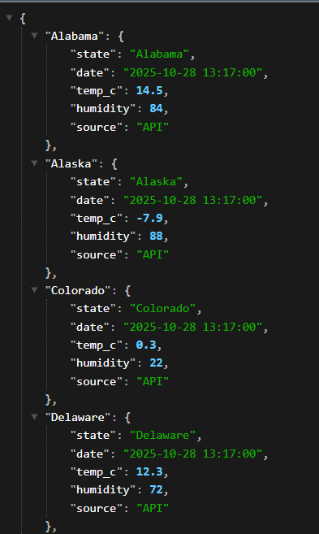

<h1 align= 'center'>Fake Weather App</h1>

<p align='center'>
    
    
    
</p>

## 🌤️ Overview
A simple weather application simulator built with Go. This app generates random weather data for demonstration purposes.

### ✨ Features
- Random temperature generation
- Simulated weather conditions
- Real-time updates
- Multiple city support

### 🚀 Quick Start
```bash
go run main.go
```

### 🛠️ Technologies
- Go
- HTTP Server
- JSON API

